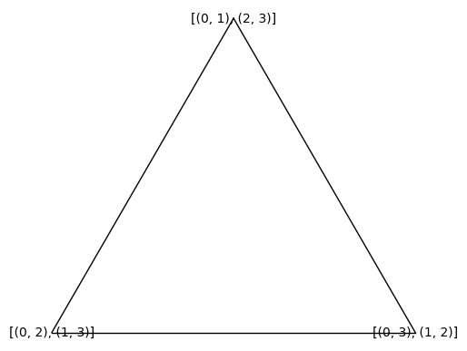
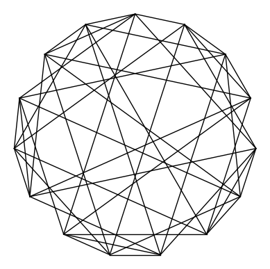
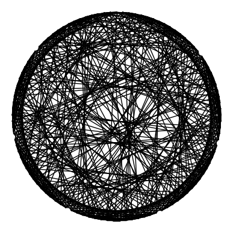

# Flip graphs on Perfect Matchings
We explore the flip graphs on perfect matchings of complete graphs of even order, $\mathcal{M}(K_{2n})$. The vertices of these graphs are the perfect matchings of $K_{2n}$ and two perfect matchings are adjacent if their symmetric difference is a cycle of length $4$. 

## Getting Started
For our exploration, we will be using SageMath 9.0 as the kernel. We will be using Sage's `graph` objects and methods and perfect matchings will be represented as a list of tuples.

## Constructing the graphs

####   We begin with some bookkeeping. We first define some functions we will be using 


```python
import itertools

def symdiff(a, b):
    # function takes in two vertices (perfect matchings represented as list of unordered pairs) and returns the symmetric difference of the two vertices
    temp = []
    temp1 = b[:]
    for i in a:
        temp1.remove(i) if i in temp1 else temp.append(i)
    for j in temp1:
        temp.append(j)
    return temp

def reverse_string(string):
    # function takes in a string and returns the string, reversed 
    return string[::-1]
```

#### Next, we define the adjacency relations for the relevant graphs.


```python
def reversal_graph_adjacency(a, b):
    # checks if two vertices are connected in the reversal graph
    # the vertices are permutations of [n]
    n = len(a)
    for j in range(0, n):
        for i in range(2, n-j+1):
            if b == a[0:j] + reverse_string(a[j:i+j]) + a[i+j::]:
                return 1
    return 0

def signed_reversal_graph_adjacency(a, b):
    # checks if two vertices are connected in the signed reversal graph
    # the vertices are represented as an ordered list of two strings, with the zero-th element being a permutation of [n] and the first element being a 01-string corresponding to the zero-th element    
    n = len(a[0])
    for j in range(0, n):
        for i in range(1, n-j+1):
            if b[0] == a[0][0:j] + reverse_string(a[0][j:i+j]) + a[0][i+j::]:
                if b[1] == a[1][0:j] + reverse_string(a[1][j:i+j]).translate(str.maketrans("10", "01")) + a[1][i+j::]:
                    return 1
    return 0 

def cover_of_reversal_graph_adjacency(a, b):
    for j in range(0, len(a[0])):
        for i in range(2, len(a[0])-j+1):
            if b[0] == a[0][0:j] + reverse_string(a[0][j:i+j]) + a[0][i+j::]:
                if b[1] == a[1][0:j] + reverse_string(a[1][j:i+j]).translate(str.maketrans("10", "01")) + a[1][i+j::]:
                    return 1
    return 0

def pancake_graph_adjacency(a, b):
    n = len(a)
    for i in range(2, n+1):
        if b == reverse_string(a[0:i]) + a[i::]:
            return 1
    return 0

def burnt_pancake_graph_adjacency(a, b):
    for i in range(1, len(a[0])+1):
        if b[0] == reverse_string(a[0][0:i]) + a[0][i::]:
            if b[1] == reverse_string(a[1][0:i]).translate(str.maketrans("10", "01")) + a[1][i::]:
                return 1
    return 0

def cover_of_pancake_graph_adjacency(a, b):
    for i in range(2, len(a[0])+1):
        if b[0] == reverse_string(a[0][0:i]) + a[0][i::]:
            if b[1] == reverse_string(a[1][0:i]).translate(str.maketrans("10", "01")) + a[1][i::]:
                return 1
    return 0
```

#### Followed by the graph constructors.


```python
def reversal_graph(n):	
    H= range(1, n+1)
    vertices=[]
    for i in itertools.permutations(H, int(n)):
        vertices.append("".join(str(x) for x in list(i)))
    Rn = Graph()
    for i in itertools.combinations(vertices, 2):
        if reversal_graph_adjacency(i[0], i[1]):
            Rn.add_edge(i[0], i[1])
    return Rn 
    
def pancake_graph(n):	
    H= range(1, n+1)
    vertices=[]
    for i in itertools.permutations(H, int(n)):
        vertices.append("".join(str(x) for x in list(i)))
    Pn=Graph()
    for i in itertools.combinations(vertices, 2):
        if pancake_graph_adjacency(i[0], i[1]):
            Pn.add_edge(i[0], i[1])
    return Pn

def signed_reversal_graph(n):
    H= range(1,n+1)
    vertices=[]
    W = Words(alphabet='01', length = n)
    for i in itertools.permutations(H, int(n)):
        i = ["".join(str(x) for x in list(i))]
        for j in W:
            vertices.append([i[0], str(j)])
    SRn = Graph()
    for i in itertools.combinations(vertices,2):
        if signed_reversal_graph_adjacency(i[0],i[1]):
            SRn.add_edge(tuple(i[0]),tuple(i[1]))
    return SRn

def burnt_pancake_graph(n):
    H= range(1,n+1)
    vertices=[]
    W = Words(alphabet='01', length = n)
    for i in itertools.permutations(H, int(n)):
        i = ["".join(str(x) for x in list(i))]
        for j in W:
            vertices.append([i[0], str(j)])
    BPn = Graph()
    for i in itertools.combinations(vertices,2):
        if burnt_pancake_graph_adjacency(i[0],i[1]):
            BPn.add_edge(tuple(i[0]),tuple(i[1]))
    return BPn    
    
def cover_of_pancake_graph(n):
    H= range(1,n+1)
    vertices=[]
    W = Words(alphabet='01', length = n)
    for i in itertools.permutations(H, int(n)):
        i = ["".join(str(x) for x in list(i))]
        for j in W:
            vertices.append([i[0], str(j)])
    CPn = Graph()
    for i in itertools.combinations(vertices,2):
        if cover_of_pancake_graph_adjacency(i[0],i[1]):
            CPn.add_edge(tuple(i[0]),tuple(i[1]))
    return CPn    

def cover_of_reversal_graph(n):
    H= range(1,n+1)
    vertices=[]
    W = Words(alphabet='01', length = n)
    for i in itertools.permutations(H, int(n)):
        i = ["".join(str(x) for x in list(i))]
        for j in W:
            vertices.append([i[0], str(j)])
    CRn = Graph()
    for i in itertools.combinations(vertices,2):
        if cover_of_reversal_graph_adjacency(i[0],i[1]):
            CRn.add_edge(tuple(i[0]),tuple(i[1]))
    return CRn

def flip_graph(n):
    G = graphs.CompleteGraph(2*n)
    H = (PerfectMatchings(G).list())
    G1 = Graph()
    # whole intended graph
    for a,b in itertools.combinations(H,2):
        if len(symdiff(a,b))==4:
            G1.add_edge(a,b)
    return G1
```

###### Flip graphs on $K_{4}$
We first look at the flip graph on $\mathcal{M}(K_4)$. This is a $3-$cycle with chromatic number $3$.


```python
g2 = flip_graph(2)
###### Flip graphs on $K_{4}$
plot(g2,vertex_size = 0, layout = 'circular')
```





###### Flip graphs on $K_{6}$

Next, we look at $\mathcal{M}(K_6)$ and some of its properties.


```python
g3 = flip_graph(3)
G3 = plot(g3,vertex_size = 0, vertex_labels = False, layout = 'circular')
G3.show()
print('The chromatic number is ' + str(g3.chromatic_number()))
print('The independence number is ' + str(g3.independent_set(value_only = True)))
```





    The chromatic number is 4
    The independence number is 5


###### Flip graphs on $K_{8}$

Next, we look at $\mathcal{M}(K_8)$. This is a graph on 105 vertices with 630 edges.


```python
g4 = flip_graph(4)
G4 = plot(g3,vertex_size = 0, vertex_labels = False, layout = 'circular')
G4.show()
print('The chromatic number is ' + str(g4.chromatic_number()))
print('The independence number is ' + str(g4.independent_set(value_only = True)))
```





    The chromatic number is 5
    The independence number is 28


###### Flip graphs on $K_{10}$

Next, we look at $\mathcal{M}(K_{10})$. This is a graph on 945 vertices with 9450 edges. Sage's methods to compute chromatic number and independence number becomes too slow to be feasible.


```python
from sage.graphs.graph_coloring import first_coloring
g5 = flip_graph(5)
sets = first_coloring(g5, k = 6)
```

This gives us a 6-coloring of $\mathcal{M}(K_{10})$. We can check the coloring below.


```python
c =[4,3,2,1,2,0,2,3,4,1,0,5,4,5,0,0,4,5,3,1,4,5,0,3,2,4,1,3,1,5,5,2,0,4,0,1,0,3,4,3,5,2,2,3,1,4,0,3,1,5,0,3,0,5,4,2,3,1,4,2,3,2,1,5,1,3,1,2,4,3,4,5,5,0,4,4,1,0,0,2,1,5,3,0,4,5,3,3,4,5,5,3,1,1,5,3,3,2,4,1,4,2,5,2,4,0,4,1,5,3,4,1,2,0,0,4,1,3,2,5,4,2,0,0,5,3,3,4,1,1,2,0,5,4,3,1,0,2,5,2,0,2,0,5,5,1,3,3,2,4,2,4,0,3,1,5,1,5,3,3,4,0,2,5,3,0,1,3,1,3,0,3,4,2,0,2,4,1,4,2,2,3,4,4,5,2,0,1,5,2,3,0,5,2,4,1,5,2,2,1,0,5,4,1,3,5,4,1,4,3,1,5,0,3,1,5,0,4,1,3,1,4,1,4,3,0,4,5,1,3,0,4,0,5,0,4,1,2,0,4,5,1,4,3,0,5,1,3,0,3,0,2,0,4,1,4,0,1,1,5,2,3,0,5,2,5,1,5,3,2,1,5,4,5,0,1,4,5,0,1,0,5,3,2,4,4,0,3,0,3,5,1,4,2,4,2,3,2,4,1,0,3,1,1,0,3,3,2,4,1,4,2,0,2,4,5,1,2,1,3,0,2,5,4,5,0,3,4,3,1,1,5,4,2,4,1,5,1,3,2,3,4,0,1,3,2,4,3,5,3,0,3,5,1,0,2,5,1,3,0,3,1,4,4,0,1,1,2,4,4,1,0,3,0,5,4,0,1,0,2,4,3,4,2,5,2,3,2,4,1,3,1,0,1,0,3,0,2,4,3,4,2,1,3,5,2,0,4,3,2,5,4,3,1,5,2,4,2,5,0,0,3,5,2,5,4,1,2,0,2,3,1,0,5,3,2,0,3,0,1,2,3,0,1,4,5,0,5,2,4,3,5,1,2,0,3,5,4,0,2,0,4,0,4,2,5,2,0,0,5,4,4,3,5,0,4,3,2,1,0,0,5,2,4,1,3,1,5,0,2,1,5,5,2,3,1,0,4,3,4,1,4,1,2,1,0,4,3,5,0,4,3,1,2,1,3,0,5,4,2,3,5,5,0,3,5,2,4,4,0,3,0,1,4,1,0,2,5,3,4,1,5,0,2,4,5,4,5,0,3,1,4,2,4,0,4,0,5,5,2,0,3,1,2,5,2,1,4,1,3,0,5,1,3,0,2,2,4,0,1,0,4,3,4,2,1,0,3,5,3,1,4,0,3,5,2,0,0,1,4,4,2,0,2,5,3,3,2,5,0,5,1,1,0,3,0,5,3,1,2,5,2,0,1,3,4,2,0,3,5,4,3,5,0,5,2,5,3,1,4,1,3,0,5,1,0,4,1,4,1,0,1,4,3,0,3,1,5,1,3,1,2,0,2,0,5,5,3,1,3,5,2,1,3,5,5,4,3,1,2,4,0,1,5,5,4,0,2,0,4,0,1,4,2,0,3,3,5,0,2,0,1,5,4,2,5,4,2,1,2,5,4,3,1,1,4,3,0,3,1,4,3,0,0,5,1,1,4,2,4,1,0,3,5,2,0,4,1,5,1,0,2,4,3,3,0,5,4,1,2,1,2,5,2,0,3,0,3,5,5,1,2,1,3,5,2,3,4,3,1,2,4,5,0,2,0,3,5,1,0,0,2,5,4,5,3,5,2,1,0,1,2,4,3,1,5,0,2,3,2,5,1,0,4,3,4,0,0,2,4,4,3,0,0,1,4,5,4,0,0,1,5,3,4,0,2,5,1,4,0,3,0,2,4,2,0,1,5,3,4,2,1,4,4,0,1,1,5,2,2,3,0,0,5,1,4,5,0,3,4,5,5,1,3,0,5,1,2,1,3,0,2,5,4,3,1,1,0,4,4,1,2,0,3,5,2,1,0,5,0,4,4,1,0,5,4,3,3,2,4,3,2,5,0,1,2,5,2,3,0,3,5,4,1,0,5,1,3,1,3,0,0,1,4,5,4,1,1,3,4,1,3,5,5,1,2,2,0,5,0,3,4,4,1,3]
for i in range(6):
    indices = [j for j, x in enumerate(c) if x == i] # extract indices corresponding to i
    independent_set = [G1.vertices()[k] for k in indices] # extract vertices with the index in indices
    print (len(independent_set))
    print('Vertices corresponding to the '+str(i)+'-th color are independent: '+str(G1.is_independent_set(independent_set)))
```

    171
    Vertices corresponding to the 0-th color are independent: True
    165
    Vertices corresponding to the 1-th color are independent: True
    140
    Vertices corresponding to the 2-th color are independent: True
    157
    Vertices corresponding to the 3-th color are independent: True
    161
    Vertices corresponding to the 4-th color are independent: True
    151
    Vertices corresponding to the 5-th color are independent: True

